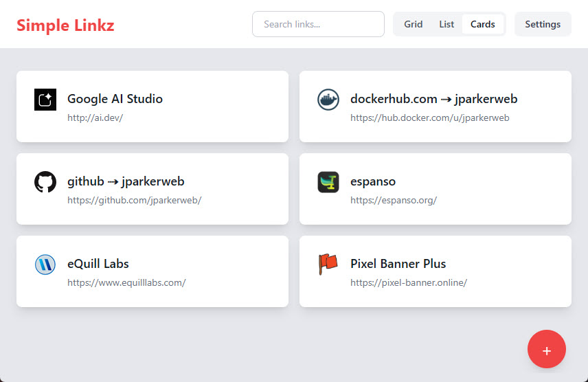
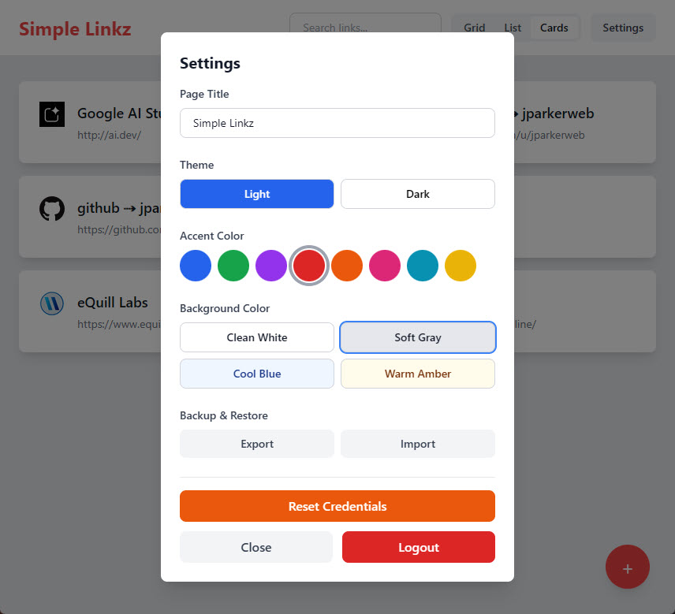
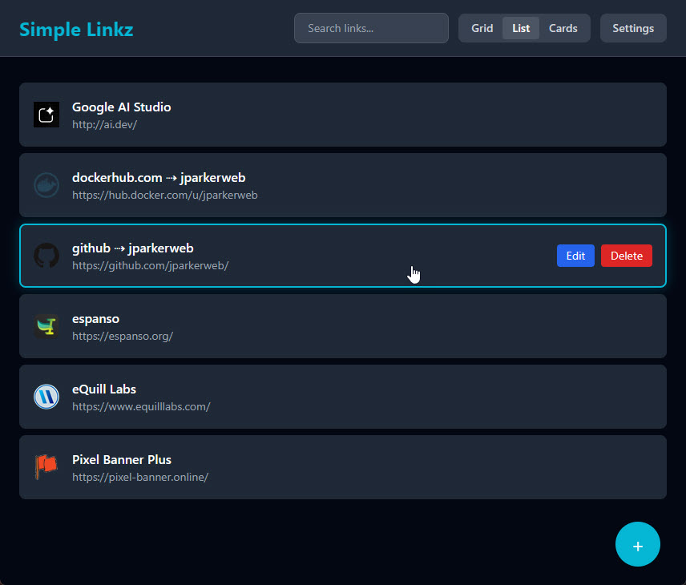

# 🖇️ Simple Linkz
A lightweight, self-hosted web application for curating and managing your frequently visited links. Built with vanilla JavaScript, Node.js, and Tailwind CSS.


## Features

- ✨ **Beautiful Dashboard** - Choose between grid, list, or cards layout
- 🔐 **Secure Authentication** - Password-hashed login with session management
- 🎨 **Customizable Themes** - Dark/light mode with 5 accent colors and custom backgrounds
- 🔍 **Search & Filter** - Quickly find links as your collection grows
- 🎯 **Drag & Drop** - Reorder links easily with visual feedback
- 💾 **Import/Export** - Backup and restore your links in JSON format
- 🐳 **Docker Ready** - Easy deployment with Docker or docker-compose
- 🪶 **Lightweight** - Minimal dependencies, fast and simple
- 🎭 **Custom Page Titles** - Personalize your dashboard title
- 🌐 **Auto Favicons** - Automatically fetches favicons for your links

## Quick Start

### Local Development

```bash
# Install dependencies
npm install

# Build CSS
npm run build:css

# Start server
npm start

# Visit http://localhost:3000
```

For development with auto-rebuild:
```bash
# Watch CSS and start server
npm run watch:css &
npm start

# Or use the dev command (builds CSS then starts)
npm run dev
```

### Docker

```bash
# Pull and run the latest image
docker run -d -p 3000:3000 -v ./data:/data jparkerweb/simple-linkz:latest

# Run with custom port and session secret
docker run -d -p 8080:8080 \
  -e PORT=8080 \
  -e SESSION_SECRET=your-secret-key \
  -v ./data:/data \
  jparkerweb/simple-linkz:latest

# Run behind reverse proxy at a subpath (e.g., yourdomain.com/simple-linkz)
docker run -d -p 3000:3000 \
  -e BASE_PATH=/simple-linkz \
  -v ./data:/data \
  jparkerweb/simple-linkz:latest

# Or build your own image
docker build -t simple-linkz .
docker run -d -p 3000:3000 -v ./data:/data simple-linkz
```

### Docker Compose

```bash
# Start in background
docker-compose up -d

# View logs
docker-compose logs -f

# Stop
docker-compose down
```

## First-Time Setup

1. On first visit, you'll be prompted to create a username and password
2. Your credentials are securely hashed and stored in `/data/data.json`
3. All your links and preferences are stored in the same file

## Resetting Credentials

If you need to reset your username or password:

1. Stop the application
2. Open `data/data.json`
3. Delete the `"user"` section (the entire object with username and passwordHash)
4. Save the file
5. Restart the application
6. You'll be prompted to create new credentials

## Environment Variables

- `PORT` - Server port (default: 3000)
- `SESSION_SECRET` - Custom session secret (auto-generated if not provided)
- `DATA_DIR` - Custom data directory path (default: ./data)
- `BASE_PATH` - Base URL path for reverse proxy subpath serving (default: empty/root)
  - Example: `BASE_PATH=/simple-linkz` allows serving at `yourdomain.com/simple-linkz`
  - Leave empty to serve from root (e.g., `yourdomain.com/`)

## Data Storage

All data is stored in a single JSON file at `./data/data.json`:

- User credentials (hashed password)
- Links (name, URL, order, favicon)
- Preferences (layout, theme, accent color)
- Active sessions

**Important**: Exclude `/data` from version control. Add it to your volume mount for Docker.

## Technologies

- **Frontend**: HTML5, Vanilla JavaScript, Tailwind CSS v3
- **Backend**: Node.js (native HTTP server)
- **Storage**: JSON file
- **Authentication**: bcryptjs, signed cookies
- **Container**: Docker (Node 20 Alpine)

## Project Structure

```
simple-linkz/
├── data/               # Data storage (git-ignored)
│   └── data.json      # All app data
├── public/            # Frontend files
│   ├── index.html
│   ├── app.js
│   └── styles.css
├── src/               # Backend modules
│   ├── server.js      # HTTP server
│   ├── storage.js     # Data persistence
│   ├── auth.js        # Authentication
│   ├── api.js         # API endpoints
│   └── input.css      # Tailwind source
├── Dockerfile
├── docker-compose.yml
└── package.json
```

## Usage Guide



### Managing Links

**Adding a Link:**
1. Click the "+" button in the header
2. Enter a name (emoji support: 📚, 🎮, etc.)
3. Enter the URL (automatically adds https:// if missing)
4. Click "Add Link" - favicon is fetched automatically

**Editing a Link:**
1. Click the edit icon on any link card
2. Modify name or URL
3. Click "Save Changes"

**Deleting a Link:**
1. Click the edit icon on the link
2. Click "Delete Link"
3. Confirm deletion

**Reordering Links:**
1. Drag any link card to a new position
2. Drop it where you want it
3. Order is saved automatically

### Customization

**Layouts:**
- **Grid**: Uniform card grid (default)
- **List**: Compact list view
- **Cards**: Larger cards with more spacing

**Themes:**
- **Light**: Clean white background
- **Dark**: Dark gray/black background

**Accent Colors:**
- Blue (default)
- Green
- Purple
- Red
- Orange

**Background Colors:**
Each theme has specific background options:
- Light theme: White, Gray, Slate, Zinc
- Dark theme: Dark, Gray variants

**Page Title:**
Click "Edit Title" in settings to customize the dashboard header.

### Backup & Restore

**Export Links:**
1. Open Settings
2. Click "Export Data"
3. Save the JSON file to your device

**Import Links:**
1. Open Settings
2. Click "Import Data"
3. Select your backup JSON file
4. Choose merge (add to existing) or replace (overwrite all)

**Manual Backup:**
Copy the entire `/data/data.json` file to a safe location.

## API Documentation

All API endpoints require authentication via session cookie (except `/api/setup` and `/api/login`).

### Authentication

**Setup User (First Time)**
```http
POST /api/setup
Content-Type: application/json

{
  "username": "admin",
  "password": "your-secure-password"
}

Response: 200 OK
{
  "success": true
}
```

**Login**
```http
POST /api/login
Content-Type: application/json

{
  "username": "admin",
  "password": "your-password"
}

Response: 200 OK
Set-Cookie: session=signed-token; HttpOnly; SameSite=Strict

{
  "success": true
}
```

**Logout**
```http
POST /api/logout

Response: 200 OK
{
  "success": true
}
```

**Check Setup Status**
```http
GET /api/setup

Response: 200 OK
{
  "needsSetup": true|false
}
```

### Links Management

**Get All Links**
```http
GET /api/links

Response: 200 OK
[
  {
    "id": "uuid",
    "name": "Example",
    "url": "https://example.com",
    "order": 0,
    "faviconUrl": "https://example.com/favicon.ico"
  }
]
```

**Add Link**
```http
POST /api/links
Content-Type: application/json

{
  "name": "GitHub",
  "url": "https://github.com"
}

Response: 201 Created
{
  "id": "uuid",
  "name": "GitHub",
  "url": "https://github.com",
  "order": 0,
  "faviconUrl": "https://github.com/favicon.ico"
}
```

**Update Link**
```http
PUT /api/links/:id
Content-Type: application/json

{
  "name": "Updated Name",
  "url": "https://newurl.com"
}

Response: 200 OK
{
  "id": "uuid",
  "name": "Updated Name",
  "url": "https://newurl.com",
  "order": 0,
  "faviconUrl": "https://newurl.com/favicon.ico"
}
```

**Delete Link**
```http
DELETE /api/links/:id

Response: 200 OK
{
  "success": true
}
```

**Reorder Links**
```http
PUT /api/links/reorder
Content-Type: application/json

{
  "linkIds": ["uuid1", "uuid2", "uuid3"]
}

Response: 200 OK
{
  "success": true
}
```

### Preferences

**Get Preferences**
```http
GET /api/preferences

Response: 200 OK
{
  "layout": "grid",
  "theme": "light",
  "accentColor": "blue",
  "backgroundColor": "white",
  "pageTitle": "Simple Linkz"
}
```

**Update Preferences**
```http
PUT /api/preferences
Content-Type: application/json

{
  "layout": "cards",
  "theme": "dark",
  "accentColor": "purple",
  "backgroundColor": "dark",
  "pageTitle": "My Links"
}

Response: 200 OK
{
  "layout": "cards",
  "theme": "dark",
  "accentColor": "purple",
  "backgroundColor": "dark",
  "pageTitle": "My Links"
}
```

### Data Import/Export

**Export Data**
```http
GET /api/export

Response: 200 OK
Content-Type: application/json

{
  "links": [...],
  "preferences": {...},
  "exportDate": "2025-01-15T12:00:00.000Z",
  "version": "1.0"
}
```

**Import Data**
```http
POST /api/import
Content-Type: application/json

{
  "links": [...],
  "preferences": {...},
  "merge": true|false
}

Response: 200 OK
{
  "success": true,
  "imported": {
    "links": 5,
    "preferences": true
  }
}
```

### Utilities

**Fetch Favicon**
```http
GET /api/favicon?url=https://example.com

Response: 200 OK
Content-Type: image/*

(binary image data)
```

## Architecture

### Backend Architecture

Simple Linkz uses a modular backend architecture with native Node.js (no Express):

**server.js** - HTTP server entry point
- Routes static files from `/public`
- Routes API requests to `api.js`
- Configurable port via `PORT` environment variable

**storage.js** - Data persistence layer
- Single JSON file storage (`/data/data.json`)
- Atomic writes using temp file + rename pattern
- Auto-initialization with sensible defaults
- Thread-safe operations

**auth.js** - Authentication & sessions
- Bcrypt password hashing (10 rounds)
- HMAC-SHA256 signed cookies
- 7-day session expiration
- Automatic session cleanup

**api.js** - RESTful API endpoints
- Request routing and parsing
- Authentication middleware
- JSON response handling
- Error handling

### Frontend Architecture

**Single Page Application (SPA)**
- Vanilla JavaScript (no framework)
- State management with reactive updates
- Modal-based UI interactions
- Client-side routing for auth states

**State Management:**
```javascript
{
  links: [],           // Array of link objects
  preferences: {},     // User preferences
  searchQuery: '',     // Current search filter
  editingLink: null    // Link being edited (or null)
}
```

**Key Functions:**
- `renderLinks()` - Dynamic rendering based on layout
- `applyTheme()` - CSS custom properties for theming
- `saveLink()` - Create/update link with validation
- `deleteLink()` - Remove link with confirmation
- `reorderLinks()` - Handle drag-and-drop

### Data Schema

```json
{
  "sessionSecret": "hex-string",
  "user": {
    "username": "string",
    "passwordHash": "bcrypt-hash"
  },
  "preferences": {
    "layout": "grid|list|cards",
    "theme": "light|dark",
    "accentColor": "blue|green|purple|red|orange",
    "backgroundColor": "white|gray|slate|zinc|dark",
    "pageTitle": "string"
  },
  "links": [
    {
      "id": "uuid-v4",
      "name": "string",
      "url": "string",
      "order": "number",
      "faviconUrl": "string"
    }
  ],
  "sessions": {
    "token": {
      "createdAt": "timestamp",
      "expiresAt": "timestamp"
    }
  }
}
```

## Security

### Authentication
- **Password Hashing**: bcrypt with 10 salt rounds
- **Session Management**: Signed cookies with HMAC-SHA256
- **Session Expiration**: 7 days, validated on each request
- **Cookie Security**: HttpOnly, SameSite=Strict flags

### Best Practices
- Single-user design (no multi-user support)
- Auto-generated session secrets
- No sensitive data in client-side storage
- Atomic file writes prevent data corruption
- Input validation on all API endpoints

### Deployment Recommendations
- Run behind reverse proxy (nginx, Caddy)
- Use HTTPS in production
- Set custom `SESSION_SECRET` environment variable
- Regular backups of `/data/data.json`
- Keep dependencies updated

## Troubleshooting

### Common Issues

**Server won't start**
```bash
# Check if port is in use
netstat -ano | findstr :3000  # Windows
lsof -i :3000                 # Linux/Mac

# Use different port
PORT=8080 npm start
```

**CSS not updating**
```bash
# Rebuild Tailwind CSS
npm run build:css

# For development, use watch mode
npm run watch:css
```

**Can't login after password reset**
- Ensure you deleted the entire `"user"` object from `data.json`
- Check that `data.json` is valid JSON
- Restart the server completely

**Links not saving**
- Check file permissions on `/data` directory
- Verify disk space is available
- Check server logs for errors

**Favicons not loading**
- Some sites block favicon requests
- Check if the site's favicon URL is accessible
- Try manually setting a favicon URL

**Import fails**
- Ensure JSON file is valid
- Check that file contains `links` array
- Verify file size is reasonable (<10MB)

### Docker Issues

**Volume mount not working**
```bash
# Use absolute path
docker run -v /full/path/to/data:/data simple-linkz

# Check volume
docker inspect <container-id>
```

**Permission errors**
```bash
# Fix data directory permissions
chmod 755 ./data
chown -R 1000:1000 ./data  # Match container user
```

### Debug Mode

Enable detailed logging:
```javascript
// Add to server.js
process.env.DEBUG = 'true';
```

## Development

### Project Structure
```
simple-linkz/
├── .github/           # GitHub workflows (if any)
├── data/              # Data storage (git-ignored)
│   └── data.json      # All app data
├── public/            # Frontend files
│   ├── index.html     # SPA shell
│   ├── app.js         # Application logic
│   └── styles.css     # Generated Tailwind CSS
├── src/               # Backend modules
│   ├── server.js      # HTTP server
│   ├── storage.js     # Data persistence
│   ├── auth.js        # Authentication
│   ├── api.js         # API endpoints
│   └── input.css      # Tailwind source
├── .dockerignore      # Docker ignore patterns
├── .gitignore         # Git ignore patterns
├── Dockerfile         # Docker image definition
├── docker-compose.yml # Docker compose config
├── package.json       # Node dependencies
├── package-lock.json  # Locked dependencies
└── tailwind.config.js # Tailwind configuration
```

### Making Changes

**Frontend Changes:**
1. Edit `public/app.js` or `public/index.html`
2. Refresh browser to see changes
3. No build step required for JS/HTML

**CSS Changes:**
1. Edit `src/input.css`
2. Run `npm run build:css`
3. Refresh browser

**Backend Changes:**
1. Edit files in `src/`
2. Restart server: `npm start`
3. Test API endpoints

### Adding Features

**New API Endpoint:**
1. Add route handler in `src/api.js`
2. Add authentication check if needed
3. Use storage functions from `storage.js`
4. Return JSON response

**New Storage Fields:**
1. Update schema in `storage.js`
2. Add getter/setter functions
3. Update `initializeData()` defaults
4. Migrate existing data if needed

**New UI Component:**
1. Add HTML to `public/index.html`
2. Add logic to `public/app.js`
3. Add Tailwind classes for styling
4. Update state management if needed

### Testing

**Manual Testing Checklist:**
- [ ] Setup flow (first-time user creation)
- [ ] Login/logout
- [ ] Add/edit/delete links
- [ ] Drag-and-drop reordering
- [ ] Search functionality
- [ ] All three layouts (grid/list/cards)
- [ ] Theme switching
- [ ] Import/export
- [ ] Password reset flow
- [ ] Mobile responsiveness

**Browser Testing:**
- Chrome/Edge (Chromium)
- Firefox
- Safari (if available)

## Contributing

Contributions are welcome! Please follow these guidelines:

1. Fork the repository
2. Create a feature branch
3. Make your changes
4. Test thoroughly
5. Submit a pull request

**Code Style:**
- Use ES6+ features
- 2-space indentation
- Semicolons required
- Descriptive variable names
- Comments for complex logic

## License

MIT

Copyright (c) 2025

Permission is hereby granted, free of charge, to any person obtaining a copy
of this software and associated documentation files (the "Software"), to deal
in the Software without restriction, including without limitation the rights
to use, copy, modify, merge, publish, distribute, sublicense, and/or sell
copies of the Software, and to permit persons to whom the Software is
furnished to do so, subject to the following conditions:

The above copyright notice and this permission notice shall be included in all
copies or substantial portions of the Software.

THE SOFTWARE IS PROVIDED "AS IS", WITHOUT WARRANTY OF ANY KIND, EXPRESS OR
IMPLIED, INCLUDING BUT NOT LIMITED TO THE WARRANTIES OF MERCHANTABILITY,
FITNESS FOR A PARTICULAR PURPOSE AND NONINFRINGEMENT. IN NO EVENT SHALL THE
AUTHORS OR COPYRIGHT HOLDERS BE LIABLE FOR ANY CLAIM, DAMAGES OR OTHER
LIABILITY, WHETHER IN AN ACTION OF CONTRACT, TORT OR OTHERWISE, ARISING FROM,
OUT OF OR IN CONNECTION WITH THE SOFTWARE OR THE USE OR OTHER DEALINGS IN THE
SOFTWARE.

## Acknowledgments

Built with:
- [Node.js](https://nodejs.org/) - Runtime environment
- [Tailwind CSS](https://tailwindcss.com/) - Utility-first CSS framework
- [bcryptjs](https://github.com/dcodeIO/bcrypt.js) - Password hashing
- [uuid](https://github.com/uuidjs/uuid) - Unique ID generation

Inspired by the need for a simple, self-hosted link manager without the bloat of larger bookmark management tools.
